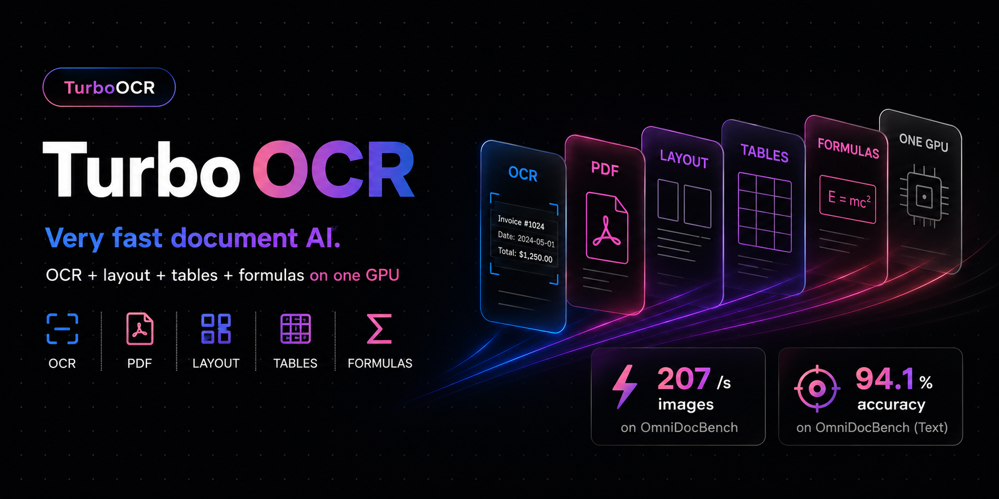

<p align="center">
  
</p>

<p align="center">
  <strong>The fastest GPU document parser — OCR · layout · tables · formulas → Markdown, at 200–556 images/s on one GPU.</strong><br>
  C++ / CUDA / TensorRT / PP-OCRv6 &mdash; Linux + NVIDIA GPU
</p>

<h3 align="center">🎉 v3.0 — now powered by PP-OCRv6</h3>
<p align="center">
  <sub>New <code>medium</code> / <code>small</code> / <code>tiny</code> tiers · higher accuracy · faster defaults · <a href="#upgrading-to-v3-breaking-changes">breaking changes ↓</a></sub>
</p>

<p align="center">
  <a href="https://github.com/aiptimizer/TurboOCR"><strong>⭐ Star TurboOCR on GitHub</strong></a> — it helps others (and agents) find it.
</p>

<p align="center">
  
  <a href="https://turboocr.com"></a>
  <a href="https://github.com/aiptimizer/TurboOCR/releases/latest"></a>
  <a href="https://ghcr.io/aiptimizer/turboocr"></a>
  
  
  
  
  <a href="https://github.com/PaddlePaddle/PaddleOCR"></a>
  
</p>

<p align="center">
  <a href="#quick-start">Quick Start</a> &middot;
  <a href="#benchmarks">Benchmarks</a> &middot;
  <a href="#models">Models</a> &middot;
  <a href="#upgrading-to-v3-breaking-changes">v3 changes</a> &middot;
  <a href="#api">API</a> &middot;
  <a href="docs/index.md">Docs</a>
</p>

---

An extremely fast GPU **document parser** — not just OCR. PP-OCRv6 detection +
recognition, plus layout, tables (→ HTML), formulas (→ LaTeX) and reading-order
**Markdown**, the whole pipeline on a single multi-stream CUDA/TensorRT engine,
locally (no VLM), behind HTTP and gRPC. Whole-page OCR runs at **up to 559 images/s
on receipts** (one RTX 5090), and full structured parsing (layout + tables + formulas)
at **~20 pages/s** — where VLM document parsers like PaddleOCR-VL run ~1 page/s. On
forms and receipts it is accurate and 15–90× faster than classic OCR engines.

- 🚀 **Up to 559 img/s** (receipts) / **520 img/s** (forms) on one RTX 5090, fastest by default
- 🎯 **Accurate on forms & receipts** &mdash; competitive with PaddleOCR-VL, PaddleOCR-Python, RapidOCR, EasyOCR and Tesseract ([benchmarks](#benchmarks))
- 🧠 **PP-OCRv6** &mdash; one model covers Latin + Chinese + Japanese; pick `tiny` (default) / `small` / `medium`
- 🌐 **More scripts** &mdash; Arabic, Cyrillic, Korean, Thai, Greek via retained PP-OCRv5 recognizers
- 📄 **PDF native** &mdash; pages rendered and OCR'd in parallel, optional page-image export & auto-rotation
- 🧩 **Layout + reading order** &mdash; PP-DocLayoutV3 (25 classes) and class-aware XY-cut, opt-in per request
- 🔢 **Tables & formulas** &mdash; opt-in SLANet+ table → HTML and PP-FormulaNet-S formula → LaTeX, emitted alongside the text ([how to enable](#tables--formulas))
- 🐳 **One-line Docker deploy** with TensorRT engines auto-built on first start, **Prometheus** metrics on `/metrics`

Full documentation: **[docs/](docs/index.md)**

---

## Quick Start

**Requirements:** Linux, NVIDIA driver 595+, Turing or newer GPU (RTX 20-series / GTX 16-series+). Plan for ~4 GB VRAM text-only and ~8 GB for the full pipeline (layout + tables + formulas); each extra `PIPELINE_POOL_SIZE` replica adds roughly another full set, so lower it on smaller cards.

```bash
docker run --gpus all -p 8000:8000 -p 50051:50051 \
  -v trt-cache:/home/ocr/.cache/turbo-ocr \
  ghcr.io/aiptimizer/turboocr:latest
```

First startup builds TensorRT engines from ONNX. This takes about 90 seconds on a
5090 GPU and up to an hour on older ones. Set `TRT_OPT_LEVEL=3` to cut build time
3 to 5x with a small speed regression. The named volume caches the engines, so
subsequent starts are instant. During the build, requests return a connection
refused error from nginx until the backend is ready. nginx (port 8000)
reverse-proxies to Drogon (port 8080), and both start automatically.

```bash
curl -X POST http://localhost:8000/ocr/raw \
  --data-binary @document.png -H "Content-Type: image/png"
```

```json
{"results": [{"text": "Invoice Total", "confidence": 0.97, "bounding_box": [[42,10],[210,10],[210,38],[42,38]]}]}
```

### Start it with the stages you want

All weights are baked into the image — just set the backend env var to load a
stage (no paths needed). Layout is on by default; each extra stage still only
runs when the request asks for it.

```bash
# text + layout (default)
docker run --gpus all -p 8000:8000 -p 50051:50051 \
  -v trt-cache:/home/ocr/.cache/turbo-ocr ghcr.io/aiptimizer/turboocr:latest

# + tables (→ HTML)       add  -e TABLE_BACKEND=slanext
# + formulas (→ LaTeX)    add  -e FORMULA_BACKEND=ppformulanet_s
# + both                  add  -e TABLE_BACKEND=slanext -e FORMULA_BACKEND=ppformulanet_s
# bigger / other language add  -e OCR_MODEL=medium   (tiny | small | medium | arabic | eslav | korean | thai | greek)
```

Then opt in per request (combine freely; `tables`/`formulas` auto-enable layout):

```bash
curl -X POST "http://localhost:8000/ocr/raw?layout=1&tables=1&formulas=1" \
  --data-binary @paper.png -H "Content-Type: image/png"
# PDF:  POST /ocr/pdf   ·   PDF → Markdown: POST /ocr/pdf?markdown=1   ·   page → Markdown: POST /ocr/markdown   ·   gRPC: port 50051
```

`GET /capabilities` reports which stages a running server has loaded.

→ [Docker & deployment](docs/build/docker.md) · [Build from source](docs/build/native.md)

---

## Benchmarks

On a single RTX 5090, vs every common OCR engine:

- **Forms & receipts (English):** accurate (FUNSD 92% / CORD 93% word-F1 on the medium tier) and **15–90× faster** than every other engine — up to **559 img/s** (receipts) on the default tiny tier. FUNSD/CORD are English/Latin-script datasets; the EN+ZH full-document numbers below include Chinese.
- **Full document parsing (EN+ZH):** **0.90** Overall on a **125-doc OmniDocBench subset** at **20 pages/s**, within ~5 points of PaddleOCR-VL (0.95, same subset) which runs at ~1 pg/s — fully local, no API. (Subset including Chinese pages, not the full 1651-page set — see [benchmarks](#benchmarks).)

→ [Full benchmarks & methodology](docs/benchmarks/comparison.md)

---

## Models

The pipeline is a small stack of specialised models, not one monolith. Text
detection + recognition + orientation always run; layout, table, and formula are
opt-in and only load when configured. Each stage links to its own model page.

| Stage | Model / arch | Size | Selected by | Docs |
|---|---|---:|---|---|
| **Text detection** | PP-OCRv6 det (DB, three tiers) | 1.7 / 9.4 / 59 MB | `OCR_MODEL` tier (`tiny`/`small`/`medium`) | [detection](docs/models/detection.md) |
| **Text recognition** | PP-OCRv6 rec (CRNN + CTC, Latin + Chinese + Japanese) | 4.3 / 20 / 73 MB | `OCR_MODEL` tier — default `tiny` | [recognition](docs/models/recognition.md) · [selection](docs/models/selection.md) |
| **Orientation** | PP-LCNet textline angle classifier | ~1 MB | always on (runs only on vertical lines) | [classification](docs/models/classification.md) |
| **Layout** | PP-DocLayoutV3 (RT-DETR-L, 25 classes) | ~124 MB | per request via `?layout=1`; disable with `DISABLE_LAYOUT=1` | [layout](docs/models/layout.md) |
| **Table → HTML** | SLANet-Plus (TRT FP16 CNN encoder + hand-written C++ GRU decoder) | ~5 MB | `TABLE_BACKEND=slanext` *(encoder auto-resolved from the bundle)* | [table](docs/models/table.md) |
| **Formula → LaTeX** | PP-FormulaNet-S, in-process pure-C++ (ORT-CUDA-13, no Python) | ~294 MB | `FORMULA_BACKEND=ppformulanet_s` | [formula](docs/models/formula.md) |

The three OCR tiers (`tiny`/`small`/`medium`) all cover the same Latin + Chinese +
Japanese scripts via `OCR_MODEL` — they trade accuracy for speed, not language coverage:
`tiny` (default) for max throughput, `small` for a balance, `medium` for best accuracy
(per-tier FUNSD F1 + throughput are in the forms benchmark above). Other scripts use
retained PP-OCRv5 recognizers, also via `OCR_MODEL`: `arabic`, `eslav` (Cyrillic),
`korean`, `thai`, `greek`.

The table/formula stages always run **locally** in C++ by default (SLANet-Plus, and
PP-FormulaNet-S on ORT-CUDA-13).

→ [Model selection guide](docs/models/selection.md)

---

## Tables & formulas

Table and formula recognition are **strictly opt-in, per request**. The router
only loads a backend when one is configured at startup, *and* a stage runs only
when the request explicitly asks for it with `?tables=1` and/or `?formulas=1`
(gRPC: the `tables` / `formulas` request fields). `layout` alone never triggers
them, so the default path pays nothing. When requested (and a backend is loaded),
the response gains `tables` (HTML + cell quads) and/or `formulas` (LaTeX) arrays.
`tables=1`/`formulas=1` auto-enable layout. Asking for a stage the server wasn't
started with is a hard error (`400 TABLE_BACKEND_DISABLED` / `FORMULA_BACKEND_DISABLED`),
never a silent empty result — check `GET /capabilities` for what a server supports.
(`/ocr/markdown` always includes both, best-effort, since a faithful Markdown export
needs them.)

| Capability | Enable at startup | Recognizer |
|---|---|---|
| Formula → LaTeX | `FORMULA_BACKEND=ppformulanet_s` | PP-FormulaNet-S |
| Table → HTML | `TABLE_BACKEND=slanext` (encoder auto-resolved from the bundle) | SLANet-Plus |

```bash
docker run --gpus all -p 8000:8000 \
  -e FORMULA_BACKEND=ppformulanet_s -e TABLE_BACKEND=slanext \
  -v trt-cache:/home/ocr/.cache/turbo-ocr ghcr.io/aiptimizer/turboocr:latest

curl -X POST "http://localhost:8000/ocr/raw?layout=1&tables=1&formulas=1" \
  --data-binary @paper.png -H "Content-Type: image/png"
```

→ [Tables](docs/models/table.md) · [Formulas](docs/models/formula.md)

---

## Running the legacy PP-OCRv5 models

The previous-generation **PP-OCRv5** detection + recognition models
(`models/det_v5.onnx`, `models/rec_v5.onnx`, `models/keys_v5.txt`) are **not**
part of the default v3 release bundle — `scripts/fetch_release_models.sh` ships
only the v6 tiers and the retained per-script v5 recognizers. To use the v5
Latin detector/recognizer, supply those three files yourself, then point the
per-stage path overrides at them — everything else (layout, table, formula,
orientation) is unchanged, so it is a drop-in swap of just the text detector +
recognizer:

```bash
DET_ONNX=models/det_v5.onnx \
REC_ONNX=models/rec_v5.onnx \
REC_DICT=models/keys_v5.txt \
LD_LIBRARY_PATH=/usr/local/tensorrt/lib ./build/turboocr-server
```

`DET_ONNX` / `REC_ONNX` / `REC_DICT` override `OCR_MODEL` per stage; the TensorRT
engine cache rebuilds for the v5 ONNX on first start (clear `~/.cache/turbo-ocr`
if v6 engines were cached under the default model names).

**Coverage caveat — Latin only.** The retained PP-OCRv5 recognizer dictionary
(`keys_v5.txt`) is 836 characters with **no CJK**. On English forms/receipts v5 is
within ~1.5–2 points of PP-OCRv6-medium (measured this release: FUNSD 90.3% vs
91.9%, CORD 91.7% vs 93.4% word-F1), but on the EN+ZH **OmniDocBench-125** set it
scores far lower (**52.7% vs 91.0%** text accuracy) because it cannot read the
Chinese pages. Use the v6 default for mixed-script documents; the v5 path is for
Latin-only workloads or direct A/B comparison.

---

## Upgrading to v3 (breaking changes)

v3 moves the default engine from PP-OCRv5 to **PP-OCRv6** and turns the server into
a full document parser — adding layout-aware **tables → HTML** and **formulas →
LaTeX** (both new in v3). The changes since v2.3 sort into three buckets; only the
first needs any action.

**Breaking / config-incompatible** (action required):

- **Server binary renamed.** The GPU server is now `turboocr-server` (was `paddle_highspeed_cpp`) and the CPU server `turboocr-cpu-server` (was `paddle_cpu_server`). Update any direct launch command, systemd unit, or wrapper script. Docker users are unaffected — the image entrypoint/`CMD` handle it.
- **Clear the TensorRT engine cache and pull the new models on upgrade.** PP-OCRv6 ships new det/rec ONNX from the `models-v3.0.0-ppocrv6` release, so cached v5 engines must rebuild — wipe `~/.cache/turbo-ocr` (or the mounted `trt-cache` volume) once. The Docker image and the native build fetch the new release automatically; pull the new image (or rebuild) to get it.

**Default-behaviour changes** (no config change, but output or runtime differ):

- **PP-OCRv6 is the default engine** (was PP-OCRv5), shipped as three tiers (`tiny`/`small`/`medium`) from the new `models-v3.0.0-ppocrv6` release. Recognition output changes vs v5.
- **Default tier is `tiny`** (max throughput). Set `OCR_MODEL=small` or `medium` for higher accuracy.
- **`LAYOUT_MERGE_MODE` default changed to `all`** (was effectively `large` / keep-outer). `all` keeps every detected box and drops nothing, so formulas/tables/titles nested inside a larger region survive (≈ +0.008 table TEDS, ≈ −0.006 formula CDM on OmniDocBench). Set `LAYOUT_MERGE_MODE=outer` to restore the previous behaviour. The mode *names* also changed (`outer`/`inner`/`all`, formerly `large`/`small`/`union`), but the old names still work as **deprecated aliases** — so the rename itself is not breaking. Modes: `outer` keeps the outer/container box and drops boxes nested inside it; `inner` keeps the innermost boxes and drops the pure containers; `all` keeps both.
- **Requests now time out at 60 s** instead of hanging unbounded. `REQUEST_TIMEOUT_MS` default changed `0` → `60000`: a wedged GPU slot returns `504 INFERENCE_TIMEOUT` and frees itself. Set `REQUEST_TIMEOUT_MS=0` to opt back into the old unbounded wait. A companion watchdog (`PIPELINE_HARD_KILL_MS`, default `600000` = 10 min) `_Exit`s the process for the orchestrator to restart **only** if a worker stays wedged mid-CUDA long after a recycle was already requested — so a genuine hang can now terminate the process instead of leaking a slot forever (this watchdog is inert when `REQUEST_TIMEOUT_MS=0`).
- **Detection resize defaults changed** (max-side `960` → `limit_type=min`, `limit_side_len=64`, `max_side_limit=1280`), so detection boxes — and therefore OCR output — differ slightly. Tune via `DET_MAX_SIDE_LIMIT` / `DET_LIMIT_TYPE` / `DET_LIMIT_SIDE_LEN` (`DET_MAX_SIDE` still honored).
- **GPU out-of-memory now returns `500 INFERENCE_ERROR`** instead of a blank `200`, and a sticky CUDA fault `_Exit`s the process for a clean restart. Under sustained overload, queued work whose client deadline already elapsed is dropped (the caller gets its `504`) rather than processed late. Clients should handle 5xx/504 and retry.
- **A bare launch announces text-only mode.** With neither `FORMULA_BACKEND` nor `TABLE_BACKEND` set, the server runs text-only (tables/formulas empty) and now logs a one-time `[Pipeline] NOTE: table + formula stages are DISABLED — running TEXT-ONLY …`, so a text-only run can't be silently mistaken for a full-document one.
- **New input-size caps** (previously-accepted requests are now rejected): `/ocr/batch` and gRPC `RecognizeBatch` cap at **1024 images** → `400 BATCH_TOO_LARGE` (split the batch or raise `MAX_BATCH_IMAGES`); `/ocr/pdf` rendered pages cap at **~40 MP/page** → very large pages at high DPI fail to render (lower `?dpi=` or raise `MAX_PDF_PAGE_PIXELS_MP`); and `/ocr`, `/ocr/raw`, `/ocr/batch`, `/infer` now also reject images over **128 MP total area** → `400 PIXELS_TOO_LARGE`, in addition to the existing per-side `MAX_IMAGE_DIM` guard (downscale, or raise `MAX_IMAGE_PIXELS_MP`).

**Additive / transparent** (nothing to do):

- **`OCR_MODEL` is the new selector name; `OCR_LANG` still works** as a deprecated alias (warns on use), so this is backward-compatible. Select by tier/model name (`tiny`/`small`/`medium`, or `arabic`/`eslav`/`korean`/`thai`/`greek`).
- **New: formula recognition → LaTeX.** `FORMULA_BACKEND=ppformulanet_s` adds an **in-process pure-C++ PP-FormulaNet-S recognizer** (ORT-CUDA-13 on the GPU build, ORT-CPU on the CPU build — no Python, no sidecar). Use `ppformulanet_plus_m` for Chinese-capable formulas, or `vlm` to route to a VLM. Opt-in; off by default.
- **New: table recognition → HTML.** `TABLE_BACKEND=slanext` adds the SLANet-Plus structure model (TRT FP16 encoder + hand-written C++ decoder); the encoder auto-resolves from the bundled model, so no extra path env is needed. Opt-in; off by default.
- **New `POST /ocr/markdown` route** (GPU build) exports a parsed page as faithful Markdown. Purely additive — existing routes are unchanged.
- **Oversized-image guard on `/infer`.** Like the other image routes, `/infer` now rejects inputs whose dimensions exceed `MAX_IMAGE_DIM` (default `16384`) with `400 DIMENSIONS_TOO_LARGE` (a decompression-bomb guard). Only affects callers that were sending images larger than 16384 px on a side.
- **New `*_degraded` response signals.** When a configured stage produces nothing, the JSON now carries `text_degraded` / `table_degraded` / `formula_degraded` (+ a `*_warning` string) on `/ocr`, `/ocr/raw`, `/ocr/batch` and `/ocr/pdf`, and `/ocr/markdown` sets an `X-OCR-Degraded` header — so a partial result is never a silent clean `200` (a configured-but-failed stage also now fails at boot rather than serving empties). New fields only; ignore them and nothing changes.
- **New: document auto-rotation.** `?autorotate=1` straightens rotated/skewed pages with a PP-LCNet orientation model before OCR (opt-in per request).
- **New `GET /capabilities`** (runtime feature/route discovery) — opt-in and additive.

---

## API

One binary serves HTTP and gRPC from a shared GPU pipeline pool.

| Endpoint | Purpose |
|---|---|
| `POST /ocr/raw` | OCR raw image bytes (fastest) |
| `POST /ocr` | OCR base64 image in JSON |
| `POST /ocr/pixels` | Zero-decode raw pixel buffer |
| `POST /ocr/batch` | Batch of images |
| `POST /ocr/pdf` | PDF → text (optional page images & auto-rotate); `?markdown=1` → whole PDF as Markdown |
| `POST /ocr/markdown` | Page → faithful Markdown (GPU build; requires layout) |
| `POST /infer` | OCR + layout / reading-order / blocks in one structured response |
| `GET /capabilities` | Runtime feature & route discovery |
| `GET /metrics` | Prometheus metrics |
| `GET /health` · `/health/live` · `/health/ready` | Liveness / readiness probes |

All endpoints accept `?layout=1` (region detection + reading order), and
`?tables=1` / `?formulas=1` to additionally run table → HTML / formula → LaTeX on
detected regions (strict opt-in — see [Tables & formulas](#tables--formulas)). Example:

```bash
curl -X POST "http://localhost:8000/ocr/raw?layout=1&tables=1&formulas=1" \
  --data-binary @document.png -H "Content-Type: image/png"
```

→ [HTTP API](docs/api/http.md) · [gRPC API](docs/api/grpc.md) · [Monitoring](docs/api/monitoring.md)

---

## Configuration

Everything is configured by environment variable (and an equivalent CLI flag).
Common ones:

| Variable | Default | Description |
|---|---|---|
| `OCR_MODEL` | `tiny` | `tiny` / `small` / `medium`, or a PP-OCRv5 script model |
| `DISABLE_LAYOUT` | `0` | `1` skips the layout model (~300–500 MB VRAM) |
| `LAYOUT_MERGE_MODE` | `all` | Nested-box policy: `all` (keep every box) / `outer` (outer regions only) / `inner` (innermost only). Old `large`/`small`/`union` accepted as aliases. |
| `LAYOUT_KEEP_NESTED_CHILDREN` | `0` | Only affects `outer`/`inner` modes: `1` still keeps the model's nested child regions (`figure_title`, `footnote`, `formula_number`, `paragraph_title`) instead of dropping them inside a parent. Formulas are always kept; no effect under default `all`. |
| `REQUEST_TIMEOUT_MS` | `60000` | Per-request inference deadline; on overrun returns `504` and frees the slot. `0` = unbounded (pre-v3 behaviour). |
| `PIPELINE_POOL_SIZE` | auto | Concurrent GPU pipelines |

→ [Full configuration reference (35+ variables)](docs/build/config.md)

---

## Building from Source

```bash
# Docker (recommended)
docker build -f docker/Dockerfile.gpu -t turboocr .
docker run --gpus all -p 8000:8000 -p 50051:50051 \
  -v trt-cache:/home/ocr/.cache/turbo-ocr turboocr

# Native (PP-OCRv6 models auto-fetched into ./models/ on first build)
cmake -B build -DTENSORRT_DIR=/usr/local/tensorrt
cmake --build build -j$(nproc)
LD_LIBRARY_PATH=/usr/local/tensorrt/lib ./build/turboocr-server
```

Needs GCC 13.3+/C++20, CUDA + TensorRT 10.2+, OpenCV 4.x, Drogon 1.9+, gRPC.
Wuffs, Clipper, and PDFium are vendored in `third_party/`.

→ [Build guide & GPU-architecture notes](docs/build/native.md)

---

## Acknowledgements

Built on open-source work:

- **[PaddleOCR](https://github.com/PaddlePaddle/PaddleOCR)** (Baidu) — PP-OCRv6 / PP-OCRv5 detection, recognition, and classification models, plus PP-DocLayoutV3 layout detection. This project would not exist without their research and pre-trained weights.
- **[Drogon](https://drogon.org)** — high-performance async C++ HTTP framework.
- **[Wuffs](https://github.com/google/wuffs)** — fast PNG decoder by Google (vendored).
- **[PDFium](https://pdfium.googlesource.com/pdfium/)** — PDF rendering and text extraction (vendored).
- **[Clipper](http://www.angusj.com/delphi/clipper.php)** — polygon clipping for text-detection post-processing (vendored).

## License

MIT. See [LICENSE](LICENSE).

<p align="center">
  <a href="https://github.com/aiptimizer/TurboOCR"><strong>⭐ Star TurboOCR on GitHub</strong></a><br>
  <sub>Sponsored by <a href="https://miruiq.com"><strong>Miruiq</strong></a> — AI-powered data extraction from PDFs and documents — and <a href="https://diaiq.com"><strong>DiaIQ</strong></a>.</sub>
</p>
