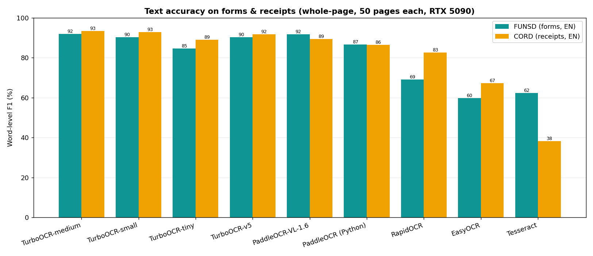

<p align="center">
  
</p>

<p align="center">
  <strong>GPU-accelerated OCR server. 15–90× faster than other OCR engines.</strong><br>
  C++ / CUDA / TensorRT / PP-OCRv6 &mdash; Linux + NVIDIA GPU
</p>

<h3 align="center">🎉 v3.0 — now powered by PP-OCRv6</h3>
<p align="center">
  <sub>New <code>medium</code> / <code>small</code> / <code>tiny</code> tiers · higher accuracy · faster defaults · <a href="#upgrading-to-v3-breaking-changes">breaking changes ↓</a></sub>
</p>

<p align="center">
  <a href="https://github.com/aiptimizer/TurboOCR"><strong>⭐ Star TurboOCR on GitHub</strong></a> — it helps others (and agents) find it.
</p>

<p align="center">
  
  <a href="https://turboocr.com"></a>
  <a href="https://github.com/aiptimizer/TurboOCR/releases/latest"></a>
  <a href="https://ghcr.io/aiptimizer/turboocr"></a>
  
  
  
  
  <a href="https://github.com/PaddlePaddle/PaddleOCR"></a>
  
</p>

<p align="center">
  <a href="#quick-start">Quick Start</a> &middot;
  <a href="#benchmarks">Benchmarks</a> &middot;
  <a href="#models">Models</a> &middot;
  <a href="#upgrading-to-v3-breaking-changes">v3 changes</a> &middot;
  <a href="#api">API</a> &middot;
  <a href="https://aiptimizer.github.io/TurboOCR/">Docs</a>
</p>

---

A production OCR server that runs PP-OCRv6 detection + recognition (+ optional
layout and PDF parsing) on a single multi-stream CUDA/TensorRT pipeline, behind
HTTP and gRPC. On forms and receipts it is both the most accurate open engine and
15–90× faster than the alternatives.

- 🚀 **Up to 556 img/s** (receipts) / **481 img/s** (forms) on one RTX 5090, fastest by default
- 🎯 **Most accurate on forms & receipts** &mdash; beats PaddleOCR-VL, PaddleOCR-Python, RapidOCR, EasyOCR and Tesseract ([benchmarks](#benchmarks))
- 🧠 **PP-OCRv6** &mdash; one model covers Latin + Chinese + Japanese; pick `tiny` (default) / `small` / `medium`
- 🌐 **More scripts** &mdash; Arabic, Cyrillic, Korean, Thai, Greek via retained PP-OCRv5 recognizers
- 📄 **PDF native** &mdash; pages rendered and OCR'd in parallel, optional page-image export & auto-rotation
- 🧩 **Layout + reading order** &mdash; PP-DocLayoutV3 (25 classes) and class-aware XY-cut, opt-in per request
- 🔢 **Tables & formulas** &mdash; opt-in SLANet+ table → HTML and PP-FormulaNet-S formula → LaTeX, emitted alongside the text ([how to enable](#tables--formulas))
- 🐳 **One-line Docker deploy** with TensorRT engines auto-built on first start, **Prometheus** metrics on `/metrics`

Full documentation: **<https://aiptimizer.github.io/TurboOCR/>**

---

## Quick Start

**Requirements:** Linux, NVIDIA driver 595+, Turing or newer GPU (RTX 20-series / GTX 16-series+).

```bash
docker run --gpus all -p 8000:8000 -p 50051:50051 \
  -v trt-cache:/home/ocr/.cache/turbo-ocr \
  ghcr.io/aiptimizer/turboocr:latest
```

First startup builds TensorRT engines from ONNX (~90s); the named volume caches
them for instant restarts. nginx (port 8000) reverse-proxies to the server.

```bash
curl -X POST http://localhost:8000/ocr/raw \
  --data-binary @document.png -H "Content-Type: image/png"
```

```json
{"results": [{"text": "Invoice Total", "confidence": 0.97, "bounding_box": [[42,10],[210,10],[210,38],[42,38]]}]}
```

→ [Docker & deployment](https://aiptimizer.github.io/TurboOCR/build/docker/) · [Build from source](https://aiptimizer.github.io/TurboOCR/build/native/)

---

## Benchmarks

Like-for-like against the common OCR engines on a single RTX 5090. Two comparisons,
because the two classes of engine are built for different jobs.

### Forms & receipts — whole-page OCR

Same images, same word-F1 metric for every engine; FUNSD (English forms) and CORD (English receipts), 50 pages each. Word-F1 = lowercased ≥2-char token overlap.




| Engine | FUNSD F1 | CORD F1 | Speed (FUNSD) |
|---|---:|---:|---:|
| **TurboOCR-medium** | **92.3%** | **93.4%** | 89 img/s |
| TurboOCR-small | 90.8% | 92.8% | 234 img/s |
| TurboOCR-tiny *(default)* | 85.4% | 88.9% | **481 img/s** |
| TurboOCR-v5 *(legacy)* | 90.2% | 91.8% | 249 img/s |
| PaddleOCR-VL-1.6 | 91.6% | 89.4% | 5 img/s |
| PaddleOCR PP-OCRv5 (Python) | 86.6% | 86.4% | 6 img/s |
| RapidOCR (GPU) | 69.1% | 82.6% | 2 img/s |
| EasyOCR | 59.8% | 67.3% | 3 img/s |
| Tesseract | 62.3% | 38.2% | 2 img/s |

TurboOCR has the best accuracy **and** is 15–90× faster than every other engine on forms and receipts.

### Complex documents — full pipeline

Papers and books need layout-aware parsing, so each TurboOCR tier and PaddleOCR-VL are run
through their **full pipeline** (layout → region recognition → reading order) and scored by
the **official OmniDocBench scorer** (text-block edit distance, OmniDocBench-125, EN+ZH):


| Pipeline | OmniDocBench-125 text accuracy | Throughput |
|---|---:|---:|
| **PaddleOCR-VL-1.5** (PP-DocLayoutV3 + 0.9B VLM) | **95.5%** | 0.94 pages/s |
| TurboOCR-small (PP-OCRv6 + PP-DocLayoutV3) | 91.3% | 70 pages/s |
| TurboOCR-medium | 91.0% | 35 pages/s |
| TurboOCR-tiny | 89.9% | 108 pages/s |

On complex full-page documents the PaddleOCR-VL vision-language model is the most accurate,
but TurboOCR's CNN pipeline is within ~4–6 points while running **35–115× faster**.
Use the VLM when every point of accuracy matters; use TurboOCR when throughput matters.

→ Full tables, metric definitions, languages, and how each pipeline is run: [Engine comparison](https://aiptimizer.github.io/TurboOCR/benchmarks/comparison/)

---

## Models

The pipeline is a small stack of specialised models, not one monolith. Text
detection + recognition + orientation always run; layout, table, and formula are
opt-in and only load when configured. Each stage links to its own model page.

| Stage | Model / arch | Size | Selected by | Docs |
|---|---|---:|---|---|
| **Text detection** | PP-OCRv6 det (DB, three tiers) | 1.7 / 9.4 / 59 MB | `OCR_MODEL` tier (`tiny`/`small`/`medium`) | [detection](docs/models/detection.md) |
| **Text recognition** | PP-OCRv6 rec (CRNN + CTC, Latin + Chinese + Japanese) | 4.3 / 20 / 73 MB | `OCR_MODEL` tier — default `tiny` | [recognition](docs/models/recognition.md) · [selection](docs/models/selection.md) |
| **Orientation** | PP-LCNet textline angle classifier | ~1 MB | always on (runs only on vertical lines) | [classification](docs/models/classification.md) |
| **Layout** | PP-DocLayoutV3 (RT-DETR-L, 25 classes) | ~124 MB | per request via `?layout=1`; disable with `DISABLE_LAYOUT=1` | [layout](docs/models/layout.md) |
| **Table → HTML** | SLANeXt (wired + wireless TRT encoder + hand-written C++ GRU decoder) | ~5 MB/encoder | `TABLE_BACKEND=slanext` *(default backend)* + encoder paths | [table](docs/models/table.md) |
| **Formula → LaTeX** | PP-FormulaNet-S, in-process pure-C++ (ORT-CUDA-13, no Python) | ~294 MB | `FORMULA_BACKEND=ppformulanet_s` | [formula](docs/models/formula.md) |
| **External VLM** *(optional)* | PaddleOCR-VL-1.6 (0.9B) on cropped table/formula regions | served separately | `TABLE_BACKEND=vlm` / `FORMULA_BACKEND=vlm` or a routing `kind:openai` entry | [VL on a separate GPU](docs/deployment_vl_separate_gpu.md) |

The three OCR tiers (`tiny`/`small`/`medium`) all cover the same Latin + Chinese +
Japanese scripts via `OCR_MODEL` — they trade accuracy for speed, not language
coverage:

| `OCR_MODEL` | FUNSD F1 | Throughput | Use it for |
|---|---:|---:|---|
| `tiny` *(default)* | 85.4% | ~481 img/s | Max throughput — edge / high-volume |
| `small` | 90.8% | ~234 img/s | Balanced accuracy/speed |
| `medium` | **92.3%** | ~89 img/s | Best accuracy |

Other scripts use retained PP-OCRv5 recognizers, also via `OCR_MODEL`: `arabic`,
`eslav` (Cyrillic), `korean`, `thai`, `greek`.

The table/formula stages always run **locally** in C++ by default (SLANeXt, and
PP-FormulaNet-S on ORT-CUDA-13). The external **PaddleOCR-VL-1.6** backend is an
opt-in accuracy lever for math/table-heavy pages: it runs on cropped regions only,
typically on its own GPU/process, and is reached over an OpenAI-compatible endpoint.

→ [Model selection guide](https://aiptimizer.github.io/TurboOCR/models/selection/)

---

## Tables & formulas

Table and formula recognition are **opt-in**: the router only loads them when a
backend is configured at startup, so the default text path is untouched. Once a
backend is set, run any request with `layout` enabled and the response gains
`tables` (HTML + cell quads) and/or `formulas` (LaTeX) arrays.

| Capability | Enable at startup | Recognizer |
|---|---|---|
| Formula → LaTeX | `FORMULA_BACKEND=ppformulanet_s` | PP-FormulaNet-S |
| Table → HTML | `TABLE_BACKEND=slanext` (+ SLANeXt model paths) | SLANet+ |

```bash
docker run --gpus all -p 8000:8000 \
  -e FORMULA_BACKEND=ppformulanet_s -e TABLE_BACKEND=slanext \
  -v trt-cache:/home/ocr/.cache/turbo-ocr ghcr.io/aiptimizer/turboocr:latest

curl -X POST "http://localhost:8000/ocr/raw?layout=1" \
  --data-binary @paper.png -H "Content-Type: image/png"
```

→ [Tables](https://aiptimizer.github.io/TurboOCR/models/table/) · [Formulas](https://aiptimizer.github.io/TurboOCR/models/formula/)

---

## Upgrading to v3 (breaking changes)

v3 moves the default engine from PP-OCRv5 to **PP-OCRv6**. Changes since v2.3:

- **PP-OCRv6 is now the default** (was PP-OCRv5), shipped as three tiers (`tiny`/`small`/`medium`) from the new `models-v3.0.0-ppocrv6` release. Recognition output and the model files change — **clear the TensorRT engine cache on upgrade** so engines rebuild from the new ONNX.
- **`OCR_MODEL` replaces `OCR_LANG`.** Select by tier/model name (`tiny`/`small`/`medium`, or `arabic`/`eslav`/`korean`/`thai`/`greek`). `OCR_LANG` still works as a **deprecated** alias (warns on use).
- **`OCR_SERVER` removed.** PP-OCRv6 covers Latin + Chinese + Japanese in one model, so the separate Chinese-server recognizer toggle is gone. Non-Latin scripts (Arabic, Cyrillic, Korean, Thai, Greek) are served by retained PP-OCRv5 recognizers.
- **Default tier is `tiny`** (max throughput). Set `OCR_MODEL=small` or `medium` for higher accuracy.
- **`LAYOUT_MERGE_MODE` values renamed and the default changed.** The nested-box modes are now `outer` / `inner` / `all` (was `large` / `small` / `union`); the old names are still accepted as **deprecated aliases**. The new **default is `all`** — it keeps every detected box and drops nothing, so formulas/tables/titles nested inside a larger region survive. To restore the previous default behaviour set `LAYOUT_MERGE_MODE=outer`. Modes: `outer` keeps the outer/container box and drops boxes nested inside it; `inner` keeps the innermost boxes and drops the pure containers; `all` keeps both.
- **The Python formula sidecar was removed.** Formula recognition (`FORMULA_BACKEND=ppformulanet_s`) is now a fully **in-process pure-C++ PP-FormulaNet-S recognizer** on ORT-CUDA-13 — there is no separate Python process to launch or manage. For a CPU formula decode set `FORMULA_DEVICE=cpu` (ORT `CPUExecutionProvider`, no CUDA and no Python).

---

## API

One binary serves HTTP and gRPC from a shared GPU pipeline pool.

| Endpoint | Purpose |
|---|---|
| `POST /ocr/raw` | OCR raw image bytes (fastest) |
| `POST /ocr` | OCR base64 image in JSON |
| `POST /ocr/pixels` | Zero-decode raw pixel buffer |
| `POST /ocr/batch` | Batch of images |
| `POST /ocr/pdf` | PDF → text (optional page images & auto-rotate) |
| `GET /metrics` | Prometheus metrics |

All endpoints accept `?layout=1` (region detection + reading order). Example:

```bash
curl -X POST "http://localhost:8000/ocr/raw?layout=1" \
  --data-binary @document.png -H "Content-Type: image/png"
```

→ [HTTP API](https://aiptimizer.github.io/TurboOCR/api/http/) · [gRPC API](https://aiptimizer.github.io/TurboOCR/api/grpc/) · [Monitoring](https://aiptimizer.github.io/TurboOCR/api/monitoring/)

---

## Configuration

Everything is configured by environment variable (and an equivalent CLI flag).
Common ones:

| Variable | Default | Description |
|---|---|---|
| `OCR_MODEL` | `tiny` | `tiny` / `small` / `medium`, or a PP-OCRv5 script model |
| `DISABLE_LAYOUT` | `0` | `1` skips the layout model (~300–500 MB VRAM) |
| `LAYOUT_MERGE_MODE` | `all` | Nested-box policy: `all` (keep every box) / `outer` (outer regions only) / `inner` (innermost only). Old `large`/`small`/`union` accepted as aliases. |
| `PIPELINE_POOL_SIZE` | auto | Concurrent GPU pipelines |

→ [Full configuration reference (35+ variables)](https://aiptimizer.github.io/TurboOCR/build/config/)

---

## Building from Source

```bash
# Docker (recommended)
docker build -f docker/Dockerfile.gpu -t turboocr .
docker run --gpus all -p 8000:8000 -p 50051:50051 \
  -v trt-cache:/home/ocr/.cache/turbo-ocr turboocr

# Native (PP-OCRv6 models auto-fetched into ./models/ on first build)
cmake -B build -DTENSORRT_DIR=/usr/local/tensorrt
cmake --build build -j$(nproc)
LD_LIBRARY_PATH=/usr/local/tensorrt/lib ./build/paddle_highspeed_cpp
```

Needs GCC 13.3+/C++20, CUDA + TensorRT 10.2+, OpenCV 4.x, Drogon 1.9+, gRPC.
Wuffs, Clipper, and PDFium are vendored in `third_party/`.

→ [Build guide & GPU-architecture notes](https://aiptimizer.github.io/TurboOCR/build/native/)

---

## Acknowledgements

Built on open-source work:

- **[PaddleOCR](https://github.com/PaddlePaddle/PaddleOCR)** (Baidu) — PP-OCRv6 / PP-OCRv5 detection, recognition, and classification models, plus PP-DocLayoutV3 layout detection. This project would not exist without their research and pre-trained weights.
- **[Drogon](https://drogon.org)** — high-performance async C++ HTTP framework.
- **[Wuffs](https://github.com/google/wuffs)** — fast PNG decoder by Google (vendored).
- **[PDFium](https://pdfium.googlesource.com/pdfium/)** — PDF rendering and text extraction (vendored).
- **[Clipper](http://www.angusj.com/delphi/clipper.php)** — polygon clipping for text-detection post-processing (vendored).

## License

MIT. See [LICENSE](LICENSE).

<p align="center">
  <a href="https://github.com/aiptimizer/TurboOCR"><strong>⭐ Star TurboOCR on GitHub</strong></a><br>
  <sub>Main Sponsor: <a href="https://miruiq.com"><strong>Miruiq</strong></a> — AI-powered data extraction from PDFs and documents.</sub>
</p>
