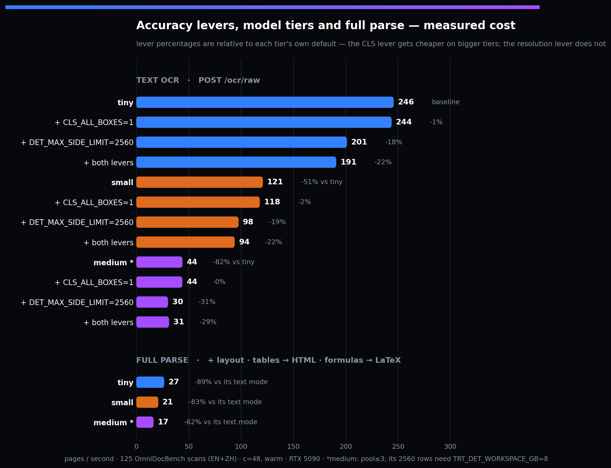

<p align="center">
  
</p>

<p align="center">
  <a href="README.md">English</a> | <strong>简体中文</strong>
</p>

<p align="center">
  <strong>最快的 GPU 文档解析器 — OCR · 版面 · 表格 · 公式 → Markdown，单卡 200–559 张/秒。</strong><br>
  C++ / CUDA / TensorRT / PP-OCRv6 &mdash; Linux + NVIDIA GPU
</p>

<h3 align="center">🎉 v3.0 — 现已搭载 PP-OCRv6</h3>
<p align="center">
  <sub>全新 <code>medium</code> / <code>small</code> / <code>tiny</code> 三档模型 · 更高精度 · 更快默认配置 · <a href="docs/build/upgrading-v3.md">破坏性变更</a></sub>
</p>

<p align="center">
  <a href="https://github.com/aiptimizer/TurboOCR"><strong>⭐ 在 GitHub 上给 TurboOCR 点个 Star</strong></a> — 让更多人（和智能体）发现它。
</p>

<p align="center">
  
  <a href="https://turboocr.com"></a>
  <a href="https://github.com/aiptimizer/TurboOCR/releases/latest"></a>
  <a href="https://ghcr.io/aiptimizer/turboocr"></a>
  
  
  
  
  <a href="https://github.com/PaddlePaddle/PaddleOCR"></a>
  
</p>

<p align="center">
  <a href="#快速开始">快速开始</a> &middot;
  <a href="#提升精度">提升精度</a> &middot;
  <a href="#基准测试">基准测试</a> &middot;
  <a href="#模型">模型</a> &middot;
  <a href="docs/build/upgrading-v3.md">v3 变更</a> &middot;
  <a href="#api">API</a> &middot;
  <a href="docs/index.md">文档</a>
</p>

---

一个极致快速的 GPU **文档解析器** — 不止是 OCR。PP-OCRv6 检测 + 识别，外加版面分析、
表格（→ HTML）、公式（→ LaTeX）与阅读顺序 **Markdown** 导出，整条流水线跑在单张
GPU 的多流 CUDA/TensorRT 引擎上，完全本地（无 VLM），同时提供 HTTP 与 gRPC 接口。
整页 OCR 在单张 RTX 5090 上最高可达 **559 张/秒（小票）**，完整结构化解析
（版面 + 表格 + 公式）约 **20 页/秒** — 而 PaddleOCR-VL 这类 VLM 文档解析器约为
1 页/秒。在表单和小票上，它既准确又比传统 OCR 引擎快 15–90 倍。

- 🚀 **最高 559 张/秒**（小票）/ **520 张/秒**（表单），单张 RTX 5090，默认即最快
- 🎯 **表单与小票高精度** &mdash; 与 PaddleOCR-VL、PaddleOCR-Python、RapidOCR、EasyOCR、Tesseract 同台竞技（[基准测试](#基准测试)）
- 🧠 **PP-OCRv6** &mdash; 一个模型覆盖拉丁 + 中文 + 日文；可选 `tiny`（默认）/ `small` / `medium`
- 🌐 **更多文字** &mdash; 阿拉伯文、西里尔文、韩文、泰文、希腊文（保留的 PP-OCRv5 识别器）
- 📄 **原生 PDF** &mdash; 页面并行渲染与识别，可选页面图片导出与自动转正
- 🧩 **版面 + 阅读顺序** &mdash; PP-DocLayoutV3（25 类）+ 类别感知 XY-cut，按请求开启
- 🔢 **表格与公式** &mdash; 按需开启：SLANet+ 表格 → HTML、PP-FormulaNet-S 公式 → LaTeX，与文本一同输出（[开启方法](#表格与公式)）
- 🐳 **一行 Docker 部署**，首次启动自动构建 TensorRT 引擎，`/metrics` 提供 **Prometheus** 指标

完整文档：**[docs/](docs/index.md)**（英文）

---

## 快速开始

**环境要求：** Linux，NVIDIA 驱动 595+，Turing 或更新架构 GPU（RTX 20 系 / GTX 16 系及以上）。纯文本约需 ~4 GB 显存，完整流水线（版面 + 表格 + 公式）约 ~8 GB；每增加一个 `PIPELINE_POOL_SIZE` 副本大约再加一整份，小显存请调低。

```bash
docker run --gpus all -p 8000:8000 -p 50051:50051 \
  -v trt-cache:/home/ocr/.cache/turbo-ocr \
  ghcr.io/aiptimizer/turboocr:latest
```

首次启动会从 ONNX 构建 TensorRT 引擎：5090 上约 90 秒，老卡最长可达一小时。设置
`TRT_OPT_LEVEL=3` 可将构建时间缩短 3–5 倍（速度略有回退）。命名卷会缓存引擎，之后
启动即秒开。构建期间 nginx 会对请求返回 connection refused，后端就绪后恢复。
nginx（8000 端口）反向代理到 Drogon（8080 端口），两者自动启动。

```bash
curl -X POST http://localhost:8000/ocr/raw \
  --data-binary @document.png -H "Content-Type: image/png"
```

```json
{"results": [{"text": "Invoice Total", "confidence": 0.97, "bounding_box": [[42,10],[210,10],[210,38],[42,38]]}]}
```

### 按需启用各阶段

所有权重已内置在镜像中 — 只需设置对应环境变量即可加载某个阶段（无需路径）。版面
分析默认开启；额外阶段仍只在请求明确要求时才运行。

```bash
# 文本 + 版面（默认）
docker run --gpus all -p 8000:8000 -p 50051:50051 \
  -v trt-cache:/home/ocr/.cache/turbo-ocr ghcr.io/aiptimizer/turboocr:latest

# + 表格（→ HTML）      加  -e TABLE_BACKEND=slanext
# + 公式（→ LaTeX）     加  -e FORMULA_BACKEND=ppformulanet_s
# + 两者                加  -e TABLE_BACKEND=slanext -e FORMULA_BACKEND=ppformulanet_s
# 更大模型 / 其他语言    加  -e OCR_MODEL=medium   (tiny | small | medium | arabic | eslav | korean | thai | greek)
```

然后按请求开启（可自由组合；`tables`/`formulas` 会自动启用版面）：

```bash
curl -X POST "http://localhost:8000/ocr/raw?layout=1&tables=1&formulas=1" \
  --data-binary @paper.png -H "Content-Type: image/png"
# PDF:  POST /ocr/pdf   ·   PDF → Markdown: POST /ocr/pdf?markdown=1   ·   单页 → Markdown: POST /ocr/markdown   ·   gRPC: 50051 端口
```

`GET /capabilities` 报告运行中的服务器加载了哪些阶段。

→ [Docker 与部署](docs/build/docker.md) · [源码构建](docs/build/native.md)

---

## 提升精度

默认配置以吞吐量优先。三个开关可以用速度换精度：

**1. 更大的模型档位** — `-e OCR_MODEL=small` 或 `medium`。语言与 API 完全相同；`small` 能修复 tiny 的大部分误读（丢空格、艺术字体），速度约减半；`medium` 精度最高。

**2. 更高的检测分辨率** — 长边超过 1280 px 的图片会在*检测*前被缩小（识别始终读取原分辨率裁剪），因此手机截图或密集扫描件上的小字可能漏检。提高上限：

```bash
-e DET_MAX_SIDE_LIMIT=2560   # 引擎一次性重建，之后走缓存
```

**3. 全行方向校正** — 默认情况下 0°/180° 方向分类器只检查竖排文本行，因此倒置的*横排*文本行不会被纠正。对于含混合方向或旋转文本行的扫描件：

```bash
-e CLS_ALL_BOXES=1                                # 检查每一行（吞吐量略降）
-e CLS_ONNX=x1_0                                  # 可选：全宽度分类器变体
```

各开关的实测吞吐量代价（所有组合，含开启表格 + 公式的完整解析）：

<p align="center">
  
</p>

---

## 基准测试

单张 RTX 5090，对比所有常见 OCR 引擎：

- **表单与小票（英文）：** 精度高（medium 档 FUNSD 92% / CORD 93% 词级 F1），比其他所有引擎**快 15–90 倍** — 默认 tiny 档在小票上最高 **559 张/秒**。FUNSD/CORD 为英文/拉丁数据集；下面的中英混合全文档指标包含中文。
- **完整文档解析（中英）：** 在 **125 篇 OmniDocBench 子集**上 Overall **0.90**，速度 **20 页/秒**，与 PaddleOCR-VL（同子集 0.95，约 1 页/秒）相差约 5 分 — 完全本地，无需 API。（该子集含中文页面，非完整 1651 页集合。）

→ [完整基准与测试方法](docs/benchmarks/comparison.md)

---

## 模型

流水线由一组专用模型组成，而非单一大模型。文本检测 + 识别 + 文本行方向始终运行；其余阶段均按需加载。

| 阶段 | 模型 / 架构 | 体积 | 选择方式 | 文档 |
|---|---|---:|---|---|
| **文本检测** | PP-OCRv6 det（DB，三档） | 1.7 / 9.4 / 59 MB | `OCR_MODEL` 档位（`tiny`/`small`/`medium`） | [detection](docs/models/detection.md) |
| **文本识别** | PP-OCRv6 rec（CRNN + CTC，拉丁 + 中文 + 日文） | 4.3 / 20 / 73 MB | `OCR_MODEL` 档位 — 默认 `tiny` | [recognition](docs/models/recognition.md) · [selection](docs/models/selection.md) |
| **文本行方向** | PP-LCNet 文本行方向分类器（每行 0°/180°） | ~1 MB | 始终开启（默认仅竖排行；`CLS_ALL_BOXES=1` 检查每一行） | [classification](docs/models/classification.md) |
| **页面方向** | PP-LCNet_x1_0_doc_ori（整页 0/90/180/270） | ~7 MB | 按请求 `/ocr/pdf?autorotate=1` | [http api](docs/api/http.md) |
| **版面分析** | PP-DocLayoutV3（RT-DETR-L，25 类） | ~124 MB | 按请求 `?layout=1`；`DISABLE_LAYOUT=1` 关闭 | [layout](docs/models/layout.md) |
| **表格 → HTML** | SLANet-Plus（TRT FP16 CNN 编码器 + 手写 C++ GRU 解码器） | ~5 MB | `TABLE_BACKEND=slanext`（编码器自动解析） | [table](docs/models/table.md) |
| **公式 → LaTeX** | PP-FormulaNet-S，进程内纯 C++（ORT-CUDA-13，无 Python） | ~294 MB | `FORMULA_BACKEND=ppformulanet_s` | [formula](docs/models/formula.md) |

三个 OCR 档位（`tiny`/`small`/`medium`）只在速度与精度之间取舍，语言覆盖相同
（均为拉丁 + 中文 + 日文，见[提升精度](#提升精度)）。其他文字使用保留的 PP-OCRv5
识别器，同样通过 `OCR_MODEL`：`arabic`、`eslav`（西里尔）、`korean`、`thai`、`greek`。
旧版 v5 拉丁检测/识别器也可换入做 A/B 对比 — 见 [Running legacy PP-OCRv5](docs/build/legacy-ppocrv5.md)。

→ [模型选择指南](docs/models/selection.md)

---

## 表格与公式

表格与公式识别**严格按请求开启**。仅当启动时配置了后端、*且*请求通过
`?tables=1` / `?formulas=1`（gRPC：`tables` / `formulas` 字段）明确要求时才运行。
仅 `layout` 不会触发它们，默认路径零开销。启用后响应增加 `tables`（HTML + 单元格
坐标）与/或 `formulas`（LaTeX）数组。`tables=1`/`formulas=1` 自动启用版面。请求
服务器未启动的阶段将返回硬错误（`400 TABLE_BACKEND_DISABLED` /
`FORMULA_BACKEND_DISABLED`），绝不会静默返回空结果 — 用 `GET /capabilities` 查看
支持情况。（`/ocr/markdown` 始终尽力包含两者，因为忠实的 Markdown 导出需要它们。）

| 能力 | 启动时开启 | 识别器 |
|---|---|---|
| 公式 → LaTeX | `FORMULA_BACKEND=ppformulanet_s` | PP-FormulaNet-S |
| 表格 → HTML | `TABLE_BACKEND=slanext`（编码器自动解析） | SLANet-Plus |

启动与请求示例见上方[快速开始](#快速开始)。

→ [表格](docs/models/table.md) · [公式](docs/models/formula.md)

---

## 升级到 v3

v3 重命名了服务器二进制，将默认引擎换为 PP-OCRv6，并调整了若干默认行为（超时、
检测缩放、输入上限）。从 v2.x 升级请阅读完整迁移指南：
**[Upgrading to v3 — breaking changes](docs/build/upgrading-v3.md)**（英文）。

---

## API

一个二进制同时提供 HTTP 与 gRPC，共享同一 GPU 流水线池。

| 端点 | 用途 |
|---|---|
| `POST /ocr/raw` | OCR 原始图片字节（最快） |
| `POST /ocr` | OCR JSON 内 base64 图片 |
| `POST /ocr/pixels` | 零解码原始像素缓冲 |
| `POST /ocr/batch` | 批量图片 |
| `POST /ocr/pdf` | PDF → 文本（可选页面图片与自动转正）；`?markdown=1` → 整本 PDF 转 Markdown |
| `POST /ocr/markdown` | 单页 → 忠实 Markdown（GPU 版；需要版面模型） |
| `POST /infer` | OCR + 版面 / 阅读顺序 / 文本块，单次结构化响应 |
| `GET /capabilities` | 运行时功能与路由发现 |
| `GET /metrics` | Prometheus 指标 |
| `GET /health` · `/health/live` · `/health/ready` | 存活 / 就绪探针 |

所有 OCR 端点都接受 `?layout=1`（区域检测 + 阅读顺序），以及 `?tables=1` /
`?formulas=1` 在检测区域上额外运行表格 → HTML / 公式 → LaTeX（严格按需 — 见
[表格与公式](#表格与公式)）。

→ [HTTP API](docs/api/http.md) · [gRPC API](docs/api/grpc.md) · [监控](docs/api/monitoring.md)

---

## 配置

一切通过环境变量配置（并有等价 CLI 参数）。常用项：

| 变量 | 默认 | 说明 |
|---|---|---|
| `OCR_MODEL` | `tiny` | `tiny` / `small` / `medium`，或 PP-OCRv5 文字模型 |
| `DISABLE_LAYOUT` | `0` | `1` 跳过版面模型（省 ~300–500 MB 显存） |
| `LAYOUT_MERGE_MODE` | `all` | 嵌套框策略：`all`（全保留）/ `outer`（仅外层）/ `inner`（仅内层）。旧名 `large`/`small`/`union` 仍作为别名接受。 |
| `LAYOUT_KEEP_NESTED_CHILDREN` | `0` | 仅影响 `outer`/`inner` 模式：`1` 保留模型的嵌套子区域（`figure_title`、`footnote`、`formula_number`、`paragraph_title`）。公式始终保留；默认 `all` 下无效果。 |
| `CLS_ALL_BOXES` | `0` | `1` 对每一行文本运行 0°/180° 方向分类器（默认只检查竖排行）— 适用于含混合方向或倒置文本行的扫描件。 |
| `REQUEST_TIMEOUT_MS` | `60000` | 单请求推理时限；超时返回 `504` 并释放槽位。`0` = 不限（v3 之前的行为）。 |
| `PIPELINE_POOL_SIZE` | 自动 | 并发 GPU 流水线数 |

→ [完整配置参考（35+ 变量）](docs/build/config.md)

---

## 源码构建

```bash
# Docker（推荐）
docker build -f docker/Dockerfile.gpu -t turboocr .
docker run --gpus all -p 8000:8000 -p 50051:50051 \
  -v trt-cache:/home/ocr/.cache/turbo-ocr turboocr

# 原生构建（首次构建自动下载 PP-OCRv6 模型到 ./models/）
cmake -B build -DTENSORRT_DIR=/usr/local/tensorrt
cmake --build build -j$(nproc)
LD_LIBRARY_PATH=/usr/local/tensorrt/lib ./build/turboocr-server
```

需要 GCC 13.3+/C++20、CUDA + TensorRT 10.2+、OpenCV 4.x、Drogon 1.9+、gRPC。
Wuffs、Clipper、PDFium 已内置于 `third_party/`。

→ [构建指南与 GPU 架构说明](docs/build/native.md)

---

## 致谢

基于以下开源项目：

- **[PaddleOCR](https://github.com/PaddlePaddle/PaddleOCR)**（百度）— PP-OCRv6 / PP-OCRv5 检测、识别、方向分类模型，以及 PP-DocLayoutV3 版面检测。没有他们的研究与预训练权重就没有本项目。
- **[Drogon](https://drogon.org)** — 高性能异步 C++ HTTP 框架。
- **[Wuffs](https://github.com/google/wuffs)** — Google 的快速 PNG 解码器（内置）。
- **[PDFium](https://pdfium.googlesource.com/pdfium/)** — PDF 渲染与文本提取（内置）。
- **[Clipper](http://www.angusj.com/delphi/clipper.php)** — 文本检测后处理多边形裁剪（内置）。

## 许可证

MIT。见 [LICENSE](LICENSE)。

<p align="center">
  <a href="https://github.com/aiptimizer/TurboOCR"><strong>⭐ 在 GitHub 上给 TurboOCR 点个 Star</strong></a><br>
  <sub>由 <a href="https://miruiq.com"><strong>Miruiq</strong></a>（AI 驱动的 PDF 与文档数据提取）与 <a href="https://diaiq.com"><strong>DiaIQ</strong></a> 赞助。</sub>
</p>
