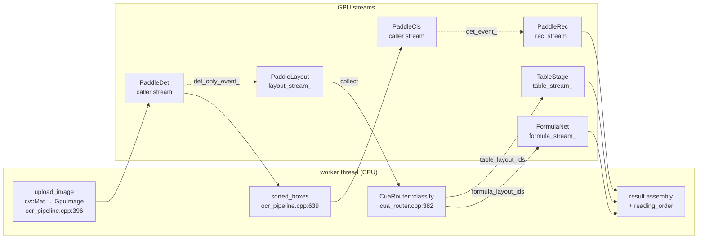

# Architecture overview

paddle-highspeed-cpp is a multi-stream OCR pipeline tuned for one number: **~270 ms p50 per page** on the text-only hot path, on an RTX 5090 (sm_120 / Blackwell). Every other design choice — TensorRT over ONNX Runtime, five named CUDA streams, lazy-loaded layout / table / formula stages, a CPU-side router — is downstream of that constraint.

## The 270 ms invariant

A single number drives the architecture. The text-only path —
`upload → det → cls → rec` — must remain bit-identical at the GPU
instruction level whether or not layout, table, or formula stages are
loaded. Plan 04 §1 calls this out as the load-bearing constraint;
plan 04 §7 makes it provable:

1. No `cudaStreamWaitEvent` on `rec_stream_` for any new event.
2. No `cudaEventRecord` on `rec_stream_` other than the existing `rec_event_`.
3. The router calls zero CUDA APIs on text-only pages.

Verifiable in code: `src/pipeline/ocr_pipeline.cpp:436` —
`dispatch_router_()` returns at line 436 (`if (!router_) return;`) and
again at line 437 (`if (out.layout.empty()) return;`) before any CUDA
call, so the only added cost on a text-only `run()` is two pointer-null
branches.

## Multi-stream fan-out

Five named CUDA streams keep stages from serialising on each other:

| Stream | Owner | Allocated in | Used by |
|---|---|---|---|
| caller `stream` | per call | n/a | upload + det + cls |
| `rec_stream_` | `OcrPipeline` | `init()` (`ocr_pipeline.cpp:135`) | recognition |
| `layout_stream_` | `OcrPipeline` | `load_layout_model()` (`ocr_pipeline.cpp:327`) | PP-DocLayoutV3 |
| `table_stream_` | `OcrPipeline` | `load_router_models()` (`ocr_pipeline.cpp:168`/`181`) | table-cls + cell-det + SLANeXt / Nemotron |
| `formula_stream_` | `OcrPipeline` | `load_router_models()` (`ocr_pipeline.cpp:203`) | FormulaNet enc + MTP decode |

Streams are created `cudaStreamNonBlocking` and the dispatcher uses
events (`det_only_event_`, `det_event_`, `rec_event_`,
`table_done_event_`, `formula_done_event_`) to fan computation out and
back in. See [CUDA Streams](cuda-streams.md) for the full event graph
and timelines.

The **text-only path uses three of the five streams** (caller, `rec_stream_`,
optionally `layout_stream_`) and pays zero cost for the two it doesn't
touch. Tables and formulas only exist on pages where the layout model
emits a `table` (class 21) or `display/inline_formula` (5 / 15) cell —
see [Router](router.md).

## Why TensorRT, not ONNX Runtime

The 270 ms target on an RTX 5090 requires kernels that exploit
Blackwell-specific tensor cores (sm_120, fp16/int8 with the new
matmul pipelines). TensorRT 10.15 picks the SM_120 codepath natively
when building engines on a 5090; ORT's CUDA EP lags by one cuDNN /
cuBLAS major version on bleeding-edge architectures and won't hit the
same SOL latencies for the same shape profiles.

The trade-off is paid at startup (TRT engines must be JIT-compiled or
loaded from a `.trt` cache) and on shape coverage (recognition uses
five width buckets — `320, 480, 800, 1600, 4000` — warmed in
`warmup_gpu()` at `ocr_pipeline.cpp:346` to eliminate first-bucket JIT
hits at request time). See [Build → Models](../build/models.md) for the
engine build flow.

## Model availability gates

Every non-text stage is **opt-in at load time**:

- `load_layout_model()` (`ocr_pipeline.cpp:313`) — sets `use_layout_`.
  Without it, `want_layout=true` is a no-op and `.layout` is always empty.
- `load_router_models()` (`ocr_pipeline.cpp:142`) — lazy-creates
  `table_stream_` / `formula_stream_` only for stages that successfully
  load. The router itself (CPU-only) is always built when this is called.
- `load_rec_engines()` / `set_shared_rec_engines()` — multi-script rec
  fan-out. `rec_engines_.size() == 1 && !script_id_` short-circuits to the
  single-engine path at `ocr_pipeline.cpp:535`, bit-identical to the
  pre-multilingual code.

A pipeline started with only `init()` and no `load_*` calls runs the
exact same GPU instruction stream as the pre-router code — the new
code is fenced off by `nullptr` member checks.

## High-level component map

The router is the only host-side dispatcher in the diagram; everything
else runs async on its own stream. See [Pipeline](pipeline.md) for the
node-by-node walk and [CUDA Streams](cuda-streams.md) for the swimlane
timelines.

!!! info "See also"
    - [Pipeline](pipeline.md) — node-by-node `run_with_layout` walk.
    - [CUDA Streams](cuda-streams.md) — the five-lane swimlane timeline and event handoffs.
    - [Router](router.md) — how layout classes route to text / table / formula.
    - [Latency](../benchmarks/latency.md) — the 6 ms p50 the invariant rests on.
