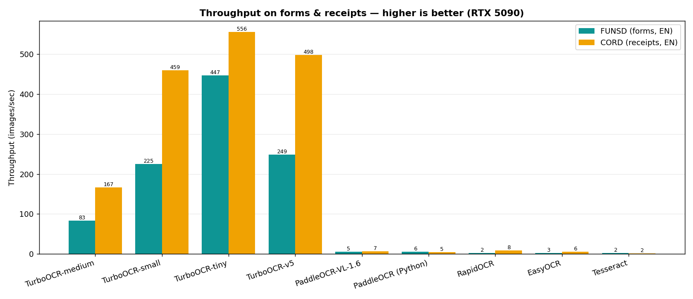
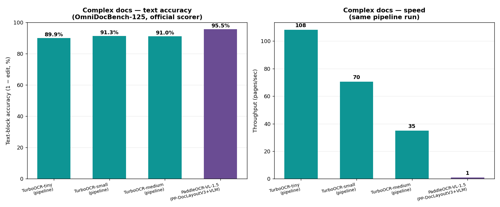

# Engine comparison — TurboOCR vs other OCR engines

A fair, like-for-like comparison of TurboOCR against the common OCR engines,
split by what each class of engine is built to do.

!!! abstract "TL;DR"
    - **Forms & receipts** (single-region): TurboOCR has the best text accuracy
      *and* is 15–90× faster than every other engine.
    - **Complex documents** (papers/books, full pipeline): TurboOCR's PP-OCRv6
      pipeline reaches **89.9–91.3%** text accuracy at **35–108 pages/s**, within
      ~5 points of **PaddleOCR-VL's 95.5%** — which runs at **0.94 pages/s**
      (a 35–115× speed gap).

## What is measured

- **Whole-page text accuracy** (forms/receipts, and the simple engines on complex
  docs): **word-level F1** — predictions and ground truth are lowercased, split
  into ≥2-char tokens, and scored by set overlap (order/duplicate-insensitive).
  Every engine gets the **same image** and the **same metric**.
- **Complex-document text accuracy** (pipeline engines): the **official
  OmniDocBench scorer**, **text-block edit distance** (text only; accuracy shown
  as 1 − edit). This is the evaluation behind PaddleOCR-VL's published numbers.
- **Hardware:** RTX 5090, 50 pages per whole-page dataset; OmniDocBench-125
  (stratified subset) for the pipeline comparison.

**Languages.** FUNSD (English forms), CORD (English receipts), and the whole-page
OmniDoc rows are **English** (the latin-only engines — Tesseract, EasyOCR,
RapidOCR, PaddleOCR-Python — cannot read the Chinese pages, so they are scored on
the English subset). The pipeline comparison uses the full **OmniDocBench-125**
stratified subset (English + Chinese); both TurboOCR (PP-OCRv6 covers
Latin + Chinese + Japanese) and PaddleOCR-VL are multilingual.

---

## Forms & receipts (whole-page)




### FUNSD — English business forms (50 pages)

| Engine | Word-F1 | Throughput |
|---|---:|---:|
| TurboOCR v6-medium | 91.9% | 83 img/s |
| PaddleOCR-VL-1.6 | 91.6% | 5 img/s |
| TurboOCR v6-small | 90.3% | 225 img/s |
| TurboOCR v5 | 90.2% | 249 img/s |
| PaddleOCR PP-OCRv5 (Python) | 86.6% | 6 img/s |
| TurboOCR v6-tiny | 84.5% | 447 img/s |
| RapidOCR (GPU) | 69.1% | 2 img/s |
| Tesseract | 62.3% | 2 img/s |
| EasyOCR | 59.8% | 3 img/s |

### CORD-v2 — English receipts (50 pages)

| Engine | Word-F1 | Throughput |
|---|---:|---:|
| TurboOCR v6-medium | 93.4% | 167 img/s |
| TurboOCR v6-small | 92.8% | 459 img/s |
| TurboOCR v5 | 91.8% | 498 img/s |
| PaddleOCR-VL-1.6 | 89.4% | 7 img/s |
| TurboOCR v6-tiny | 88.9% | 556 img/s |
| PaddleOCR PP-OCRv5 (Python) | 86.4% | 5 img/s |
| RapidOCR (GPU) | 82.6% | 8 img/s |
| EasyOCR | 67.3% | 6 img/s |
| Tesseract | 38.2% | 2 img/s |

TurboOCR has the best accuracy on both datasets and is 15–90× faster than the
next-most-accurate engine. RapidOCR is the strongest lightweight ONNX engine but
trails on both axes; Tesseract and EasyOCR trail further.

---

## Complex documents (full pipeline)

Papers and books need layout-aware parsing, so TurboOCR (all three v6 tiers) and
PaddleOCR-VL are each run through their **full pipeline** (layout → region
recognition → reading-order assembly) and scored by the **official OmniDocBench
text-block** metric. TurboOCR runs at `DET_MAX_SIDE=2048` (full A4 pages).



| Pipeline | OmniDocBench-125 text accuracy | Throughput |
|---|---:|---:|
| **PaddleOCR-VL-1.5** (PP-DocLayoutV3 + 0.9B VLM) | **95.5%** | 0.94 pages/s |
| TurboOCR-small (PP-OCRv6 + PP-DocLayoutV3) | 91.3% | 70 pages/s |
| TurboOCR-medium | 91.0% | 35 pages/s |
| TurboOCR-tiny | 89.9% | 108 pages/s |

The PaddleOCR-VL vision-language model is the most accurate on complex documents,
but TurboOCR's CNN pipeline lands within ~4–6 points of it while running **35–115×
faster**. Pick the VLM when every last point of accuracy on dense, structured
pages matters; pick TurboOCR when throughput matters.

For reference, the latin-only whole-page engines on the English OmniDoc subset
(no layout pipeline): PaddleOCR-Python 74.8%, RapidOCR 69.1%, EasyOCR 65.2%,
Tesseract 65.0% — well below either pipeline.

## How PaddleOCR-VL is run

PaddleOCR-VL is a vision-language model served by **vLLM**, queried over the
OpenAI-compatible chat API.

```bash
# Whole-page comparison — VL-1.6 served directly:
vllm serve PaddlePaddle/PaddleOCR-VL-1.6 --port 8155 --host 0.0.0.0 \
  --max-num-seqs 64 --gpu-memory-utilization 0.75 --trust-remote-code
```

In the **whole-page** comparison each page is sent as a base64 image with the
official `OCR:` prompt (`temperature=0`, `max_tokens=4096`, concurrency 8). In the
**complex-document pipeline** comparison, VL-1.5 is driven by its PP-DocLayoutV3
layout stage (`tools/omnidoc_run_paddlevl.py`, served on :8003) — which is how it
reaches its published accuracy. RapidOCR runs as the PP-OCR ONNX pipeline on GPU
(`rapidocr-onnxruntime`, CUDAExecutionProvider); PaddleOCR-Python is PP-OCRv5
mobile det+rec on GPU.

## Reproduce

```bash
# Whole-page (forms/receipts/omni). PaddleOCR-VL needs the vLLM server above.
.venv/bin/python bench_compare.py     --dataset funsd --n 50 --vl-port 8155
.venv/bin/python bench_compare.py     --dataset cord  --n 50 --vl-port 8155
.venv/bin/python bench_turbo_tiers.py --datasets funsd cord --n 50

# Complex-document pipelines (OmniDocBench-125, official scorer):
DET_MAX_SIDE=2048 OCR_MODEL=<tier> ./build/turboocr-server        # TurboOCR server
python tools/omnidoc_run.py          --images-dir <125> --out-dir <d> --server :8080
python tools/omnidoc_run_paddlevl.py --images-dir <125> --out-dir <d> --server :8003/v1
python omnidocbench/pdf_validation.py --config <end2end.yaml>          # text_block edit
```

Whole-page engines share `score()`/`tokens()` from `bench_compare.py` (one metric,
one image set). Complex-document numbers use the official OmniDocBench `text_block`
edit distance on the stratified 125-page subset.
