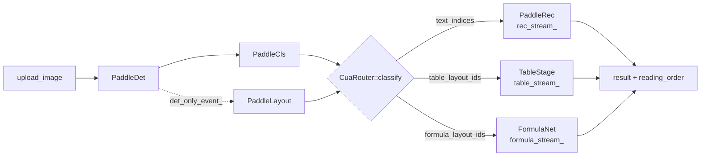
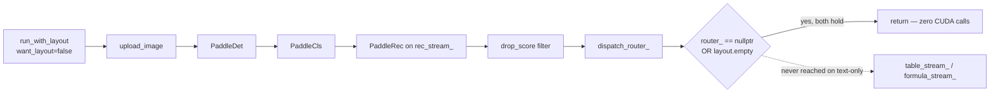
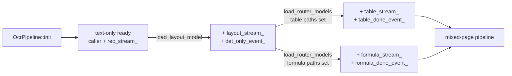

# TurboOCR

!!! abstract "TL;DR"
    Multi-stream OCR pipeline that holds **6 ms p50** on RTX 5090 for the text-only short-circuit path, with opt-in layout / table / formula stages that fan out on dedicated CUDA streams.

  
6.0 ms

  
Text-only p50 latency

  
RTX 5090, TRT 10.15.1.29

  
&asymp; 49.0

  
OmniDocBench v1.7 composite

  
full 1651 pages, 2026-05-17 — pre formula-fix, re-measure pending

  
0.568

  
Table TEDS (all)

  
full 1651 pages; +0.541 vs May 14 baseline

  
0.079

  
text_block Edit_dist (English)

  
per-language slice

-   __[Architecture](architecture/overview.md)__

    ---

    Five CUDA streams, six events, one CPU router. The 270 ms invariant and
    why the text-only GPU instruction stream is byte-identical with or
    without the new stages.

-   __[Models](models/detection.md)__

    ---

    Per-model cards: detection, classification, layout, recognition,
    table, and the in-process PP-FormulaNet-S formula stage. Input
    shapes, dynamic profiles, latency budgets.

-   __[Benchmarks](benchmarks/omnidocbench.md)__

    ---

    OmniDocBench v1.7 composite 49.0 on 1651 pages. Latency diary,
    sweep history, and the regression detector that pins the
    text-only invariant.

-   __[API](api/http.md)__

    ---

    HTTP endpoints (`/ocr/raw`, `/ocr/pixels`, `/ocr/batch`,
    `/ocr/pdf`, `/health/*`) plus the gRPC surface generated from
    `proto/turbo_ocr.proto`.

## Three-tier model fan-out

Detection + angle-cls feed the router; layout decides which downstream
pipeline owns each cell; rec, table, and formula run concurrently on
three named streams. See [Pipeline](architecture/pipeline.md) for the
node-by-node walk.

## Text-only short-circuit

Three guards make the short-circuit fire before any new CUDA API call —
`!router_` and `out.layout.empty()` at `src/pipeline/ocr_pipeline.cpp:436-437`,
and the post-classify `!has_table && !has_formula` at
`ocr_pipeline.cpp:453`. The GPU instruction stream on text-only pages is
bit-identical to the pre-router code. See
[CUDA Streams](architecture/cuda-streams.md) for the invariants.

## Table + formula opt-in

Streams and events for table / formula are **lazy-allocated inside
`load_router_models()`** — a pipeline that never calls it pays zero new
CUDA resources. Verifiable at
`src/pipeline/ocr_pipeline.cpp:167-184` (table) and
`ocr_pipeline.cpp:202-205` (formula).

## Headline numbers

| Metric | Test set | Value | Source |
|---|---|---:|---|
| Composite Overall (OmniDocBench v1.7) | full 1651 | **≈ 49.0** | `omnidocbench/result/md_quick_match_metric_result.json` (regen 2026-05-17, **pre formula-fix** — re-measure pending) |
| text_block Edit_dist — English | full 1651 | **0.079** | same file, per-language slice |
| table TEDS (.all) | full 1651 | **0.568** | same file |
| formula CDM | 125-doc table/formula subset | **0.805** | in-process PP-FormulaNet-S, FAST decoder — see [resources](resources_speed_accuracy.md) |
| table TEDS | 125-doc table/formula subset | **0.773** | same subset run |
| text-only p50 latency | — | **6.0 ms** | internal engineering notes (8 sweeps, RTX 5090, TRT 10.15.1.29) |

!!! note "Formula CDM is fixed; full-1651 re-measure pending"
    The earlier formula CDM 0.063 "regression" was an integration bug, **now resolved**: the in-process
    PP-FormulaNet-S stage (FAST decoder) scores **CDM 0.805** on the 125-doc table/formula subset. The
    ≈ 49.0 composite above is the **full-1651** run from 2026-05-17 that predates the fix and still embeds
    the broken-formula 0.063, so it is a floor pending a re-measure with the fixed stage. The two test
    sets are not directly comparable — the 125-doc cut is a deterministic, table/formula-heavy stratified
    subset; the full-1651 numbers are the whole OmniDocBench set.

Full per-language, per-layout, and per-attribute breakdowns live on the
[OmniDocBench results](benchmarks/omnidocbench.md) page; the per-fixture
latency sweep history is on the [Latency](benchmarks/latency.md) page.

The 6 ms p50 is the load-bearing constraint the entire architecture is
shaped around. The original 270 ms target turned out to be ~45×
conservative on Blackwell with TRT 10.15.

!!! info "See also"
    - [Architecture overview](architecture/overview.md) — design philosophy + the 270 ms invariant.
    - [Model interactions](models/interactions.md) — per-page life cycle sequence diagrams.
    - [OmniDocBench results](benchmarks/omnidocbench.md) — full per-language / per-layout / per-attribute tables.
    - [HTTP API](api/http.md) — request shapes, JSON response, curl examples.
